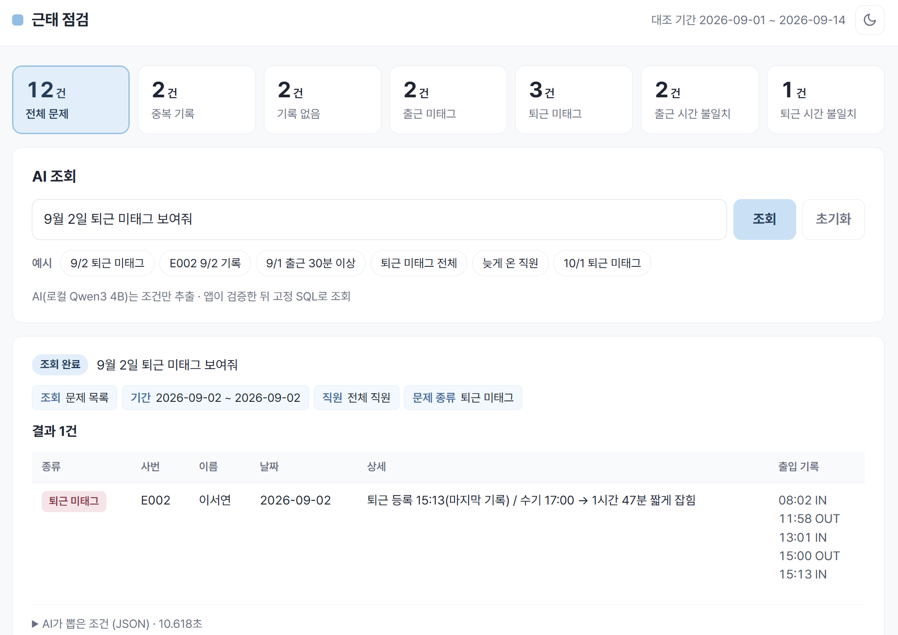
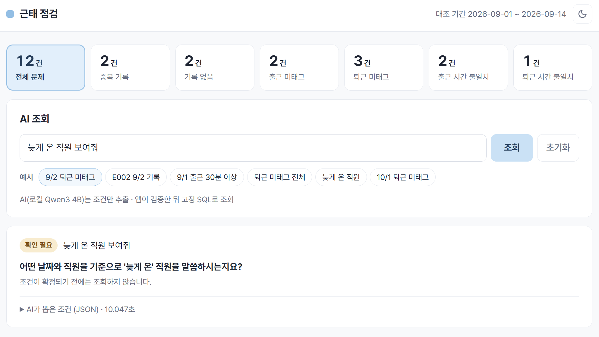
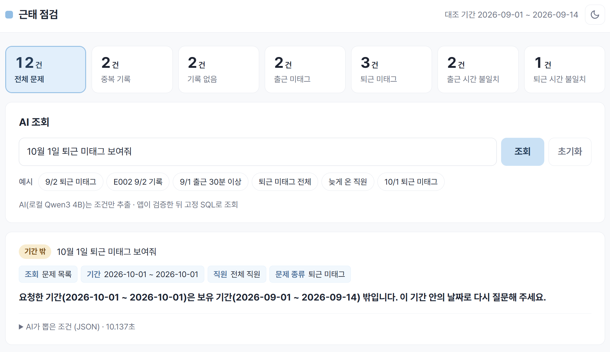

# 근태 점검 (attendance-checker)

수기 근태 기록과 출입 단말 기록을 대조해서 문제가 있는 기록을 찾고, 말로 질문하면 AI가 조건을 뽑아 조회해 주는 앱.

| 항목 | 내용 |
|---|---|
| 기술 | Python Flask, SQLite, Ollama + Qwen3 4B, Docker |
| AI 역할 | 질문에서 조회 조건만 뽑음. 실제 조회는 앱에 미리 만들어 둔 SQL이 함 |
| 검증 | 정답 12건 자동 테스트 통과, AI 평가 24회 중 24회 통과 |
| 데이터 | 시연용 가짜 데이터 (직원 12명, 2026-09-01부터 09-14까지 평일) |

## 화면

시연할 때만 서버를 켜기 때문에 동작 화면을 캡처로 남겼음.

### 정상 조회

"9월 2일 퇴근 미태그 보여줘"라고 물으면 AI가 뽑은 조건과 DB에서 찾은 결과를 함께 보여 줌.



### 뜻이 모호한 질문

"늦게 온 직원 보여줘"는 기준이 없어서 조회하지 않고 다시 물어봄.



### 데이터가 없는 기간

"10월 1일 퇴근 미태그 보여줘"는 0건으로 처리하지 않고 데이터 기간 밖이라고 알려 줌.



그 밖에 문제 종류별 카드(누르면 그 종류만 보기), 예시 질문 버튼, 초기화, 다크 모드, 휴대폰 화면 대응이 있음.

## 동작 방식

1. 사용자가 질문을 입력함. 예: 9월 2일 퇴근 미태그 보여줘
2. AI가 질문에서 날짜, 직원, 문제 종류 같은 조건을 JSON으로 뽑음
3. 앱이 조건을 검사함. 뜻이 모호하면 되묻고, 데이터 기간과 전혀 겹치지 않으면 안내만 함. 일부만 겹치면 겹치는 날짜만 조회함
4. 미리 만들어 둔 SQL에 조건을 넣어 조회하고 결과를 표로 보여 줌

AI에게 SQL을 직접 쓰게 하지 않은 이유는 검사 때문. AI가 만든 SQL은 매번 맞는지, 데이터를 지우거나 너무 많이 읽지 않는지 확인해야 함. 조건만 받으면 앱이 값 하나하나를 검사할 수 있고, 결과는 항상 실제 DB에서 나옴.

## 찾는 문제와 정답

출입 기록은 점심, 휴식 때문에 하루에도 여러 번 찍힘. 그래서 그날 첫 기록을 출근, 마지막 기록을 퇴근으로 봄.

| 문제 종류 | 뜻 | 심어 둔 정답 |
|---|---|---|
| 중복 기록 | 같은 기록이 두 번 찍힘 | E003 9/3, E007 9/10 |
| 기록 없음 | 그날 출입 기록이 없음 | E004 9/4, E008 9/9 |
| 출근 미태그 | 출근할 때 안 찍음 | E003 9/8, E008 9/11 |
| 퇴근 미태그 | 퇴근할 때 안 찍음 | E002 9/2, E005 9/7, E009 9/11 |
| 출근 시간 불일치 | 수기 기록과 10분 이상 차이 | E001 9/1, E010 9/14 |
| 퇴근 시간 불일치 | 수기 기록과 10분 이상 차이 | E006 9/8 |

정답 12건은 판정 SQL과 상관없이 직접 손으로 적었음(`answers.py`). 테스트에서 SQL 결과와 한 건씩 비교해서 빠진 것, 잘못 찾은 것, 중복이 하나도 없어야 통과함.

E011 조재희, E012 박다솜은 나중에 추가한 직원으로 문제가 없는 정상 기록만 있음. 직원 이름은 모두 지어낸 이름.

## AI 평가

정답을 미리 정해 둔 질문 8개를 3번씩, 총 24회 실행함. AI가 뽑은 조건, 앱의 처리 결과, DB 조회 결과가 모두 맞아야 통과로 셈.

| 차수 | 바뀐 점 | 결과 |
|---|---|---|
| 1차 | 처음 실행 | 18/24. 하루짜리 질문에서 AI가 끝 날짜를 비워서 실패 (앱이 막아서 틀린 결과는 보여 주지 않음) |
| 2차 | AI 지시문에 예시 추가 | 24/24 |
| 3차 | 직원 이름 변경 | 24/24 |
| 4차 | 직원 2명 추가 | 24/24 |
| 5차 | 기간이 일부만 겹칠 때 처리 방식 변경 (최종 코드) | 24/24 |

응답 시간은 노트북 CPU 기준 7초에서 13초 정도.

질문과 정답 기준은 1차 이후 바꾸지 않았고, 실패한 기록도 지우지 않았음. 회차별 기록은 [`eval/results/`](eval/results/)에 있음.

참고할 점도 있음. 같은 질문에 같은 답이 나오도록 무작위성을 꺼 두어서(temperature 0) 3번의 결과가 똑같음. 그래서 3번 반복은 결과가 재현되는지 확인한 정도의 의미. 2차부터는 1차 실패를 보고 고친 뒤의 결과이고, 질문 8개에 대한 점수라서 일반적인 정확도로 볼 수는 없음.

## 모델 선택 이유

외부 AI API 대신 직접 실행하는 모델을 썼음. 근태 기록은 실제 업무라면 사내 데이터라서 질문이 외부로 나가지 않는 쪽을 택함. 호출 비용이 없고 모델 버전을 고정할 수 있다는 점도 이유.

Ollama는 GPU 없이 CPU로 모델을 돌릴 수 있고, 응답을 정해 둔 JSON 형식으로 받을 수 있음. 공식 Docker 이미지도 있어서 앱과 모델을 이미지 하나에 넣기 쉬움.

Qwen3 4B Instruct는 노트북과 8GB급 서버에서 앱과 함께 돌릴 수 있는 크기라서 골랐음(실행 중 약 4.9GiB). 생각 과정을 출력하지 않는 버전이라 짧은 답을 빨리 냄. 한국어 질문으로 먼저 시험해 보고 이 모델로 평가를 진행함.

후보였던 Qwen3 1.7B, Gemma 3 4B와 같은 질문으로 비교하지는 않았음. 가장 좋은 모델을 찾은 것이 아니라, 정해 둔 기준을 통과한 모델.

## 실행 방법

Docker로 실행하는 방법. AI 모델까지 이미지 안에 들어 있고, 메모리가 5GiB 정도 필요함.

```bash
docker build -t attendance-checker .
docker run -d -p 7860:7860 --name attendance attendance-checker
```

첫 빌드는 모델을 내려받느라 몇 분 걸림. 컨테이너를 켜고 1분쯤 지나면 http://localhost:7860 에서 쓸 수 있음.

밖에서 접속하게 하려면 Cloudflare Quick Tunnel을 씀. 실행할 때마다 주소가 바뀜.

```bash
cloudflared tunnel --url http://localhost:7860
```

개발 환경에서 직접 실행하는 방법. Ollama를 먼저 설치해야 함.

```bash
ollama pull qwen3:4b-instruct
python3 -m venv venv && source venv/bin/activate
pip install -r requirements.txt -r requirements-dev.txt
python seed.py      # 가짜 DB 만들기
pytest -q           # 테스트 52개, AI 없이 돌아감
python app.py       # http://localhost:5000
python eval/run_eval.py --label <이름> --note "<이유>"   # AI 평가 24회
```

## 파일 구성

| 파일 | 역할 |
|---|---|
| `seed.py` | 가짜 데이터 생성 |
| `answers.py` | 심어 둔 정답 12건 |
| `checks.py` | 문제 6종을 찾는 SQL |
| `ai.py` | AI 호출, 지시문, JSON 형식 |
| `nl_query.py` | AI 응답 검사, SQL 조회, 결과 상태 구분 |
| `queries.py` | AI 조회에 쓰는 SQL 3종 (문제 목록, 직원별 기록, 시간 차이) |
| `app.py`, `templates/`, `static/` | 웹 화면 |
| `tests/` | 자동 테스트 52개 |
| `eval/` | AI 평가 질문, 실행 스크립트, 결과 기록 |
| `Dockerfile`, `entrypoint.sh` | 앱과 AI 모델을 이미지 하나로 묶음 |

## 한계

- 답할 수 있는 질문은 문제 목록, 직원별 기록, 시간 차이 세 가지.
- AI 정확도는 질문 8개로만 확인함.
- 노트북과 터널로 공개해서 항상 접속되거나 주소가 고정되지는 않음. AI는 한 번에 질문 하나만 처리함.

설계 과정과 결정 기록은 [`docs/2026-09-27-attendance-checker-design.md`](docs/2026-09-27-attendance-checker-design.md)에 있음.
