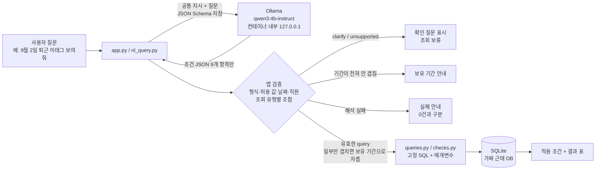

# attendance-checker — 근태 점검 (근태 대조 + AI 자연어 조회, 로컬 LLM)

수기 근태 시트와 출입 단말 기록을 SQL로 대조해 이상 기록을 찾고, 사용자가 말로 질문하면 **로컬 LLM(Qwen3 4B, Ollama)이 조회 조건만 JSON으로 뽑고 앱이 검증한 뒤 미리 작성한 SQL로 조회**하는 AX 포트폴리오 앱입니다.

- 실제 업무(수기 근태 ↔ 출입 기록 대조)를 **가짜 데이터로** 작게 재현했습니다. 실제 회사 데이터는 쓰지 않습니다.
- Flask + SQLite, Ollama `qwen3:4b-instruct`(CPU 실행), 외부 AI API 사용 안 함. Docker 이미지 하나로 실행.
- AI 평가: 사람이 기대값을 정한 8문항 × 3회 **24/24** (최종 코드 `900d4fc` 기준, 실패했던 1차 18/24 포함 전 회차 기록 공개).
- 상세 설계와 승인 이력: [`docs/2026-09-27-attendance-checker-design.md`](docs/2026-09-27-attendance-checker-design.md)

## 화면

인터넷에 상시 공개하지 않고 시연할 때만 켜므로, 동작 화면을 캡처로 남깁니다(2026-10-09, 최종 코드).

**정상 조회** — `9월 2일 퇴근 미태그 보여줘` → AI가 뽑은 조건을 칩으로 보여 주고, 결과는 실제 DB에서 가져옵니다.


**뜻이 모호한 질문** — `늦게 온 직원 보여줘` → 기준이 없으므로 AI가 되묻고 **조회하지 않습니다.**


**데이터가 없는 기간** — `10월 1일 퇴근 미태그 보여줘` → "0건"이 아니라 **보유 기간 밖**이라고 구분해서 안내합니다.


화면 기능: 문제 종류별 숫자 카드(누르면 아래 표를 그 종류만 걸러 봄), 예시 질문 칩, 결과 상태 배지(조회 완료·확인 필요·기간 밖·오류), 초기화 버튼, 휴대폰 화면 대응(조회 후 결과 위치로 이동), 다크 모드(기기 설정 따름 + 직접 전환).

## 구조



AI는 **조건만** 만듭니다. SQL·직원 결과·시각은 만들지 않으며, AI가 만든 문자열을 SQL로 실행하지 않습니다.

| 파일 | 역할 |
|---|---|
| `answers.py` | 심어 둔 정답 12건. 판정 규칙과 독립적으로 사람이 손으로 적음 |
| `seed.py` | 가짜 데이터 생성(직원 12명·평일 10일). 매번 DB를 새로 만듦. 정상 시각은 ±3분 규칙적 흔들림 |
| `checks.py` | 이상 기록 6종 SQL(중복·기록 없음·출근/퇴근 미태그·출근/퇴근 시간 불일치). 기준 `TIME_DIFF_MINUTES = 10` |
| `queries.py` | 자연어 조회용 고정 SQL 3종(문제 목록·직원별 기록·시간 차이) |
| `ai.py` | Ollama 호출, 공통 지시(프롬프트), JSON Schema, 생성 설정 |
| `nl_query.py` | AI 응답 검증 → 기본값 적용·기간 자르기 → 고정 SQL 실행 → 결과 상태 구분 |
| `app.py`, `templates/index.html`, `static/style.css` | 웹 화면(`/`), JSON API(`POST /api/ask`), `/health` |
| `tests/` | 정답 12건 검증, 검증 규칙·오류 처리, 화면, 채점기 자체 검증 (52개) |
| `eval/` | 공식 평가 문항(`questions.json`), 평가 실행기, 회차별 기록, 개발용 점검 기록, Docker 컨테이너 동작 확인(`eval/container/`) |
| `Dockerfile`, `entrypoint.sh` | 앱 + Ollama + 모델을 이미지 하나로. 컨테이너가 켜질 때 공통 지시를 미리 읽혀 둠(워밍업) |

## 실행 방법 (WSL Ubuntu 기준)

```bash
# 1) Ollama 설치 후 모델 내려받기 (Ollama 0.35.1에서 확인)
ollama pull qwen3:4b-instruct

# 2) 앱 준비
git clone https://github.com/sc8556/attendance-checker.git && cd attendance-checker
python3 -m venv venv && source venv/bin/activate
pip install -r requirements.txt -r requirements-dev.txt
python seed.py            # employees 12 / manual_sheet 120 / terminal_logs 585
pytest -q                 # 52 passed (AI 없이 실행됨)

# 3) 앱 실행 → http://localhost:5000
python app.py

# 4) 공식 평가 (8문항 × 3회, 커밋되지 않은 변경이 있으면 실행 거부)
python eval/run_eval.py --label <새 이름> --note "<실행 이유>"
```

### Docker로 실행 (Docker Engine 29.1, WSL Ubuntu에서 확인)

Ollama·모델(2.5GB)·앱·가짜 DB가 이미지 하나에 들어 있어 따로 설치할 것이 없습니다. 외부에는 앱 포트 7860만 열고, Ollama는 컨테이너 안 `127.0.0.1:11434`에서만 실행됩니다.

```bash
docker build -t attendance-checker .        # 첫 빌드는 모델 다운로드로 수 분, 이후는 레이어 캐시로 빠름
docker run -d -p 7860:7860 --name attendance attendance-checker
docker logs -f attendance                   # 첫 POST "/api/chat" 줄 = 워밍업 완료
# → http://localhost:7860
```

- **이미지 크기:** 압축 2.53GB(대부분 모델), 디스크 5.26GB.
- **메모리:** 실행 중 약 4.9GiB(`docker stats`). 1GiB급 서버에서는 실행 불가.
- **워밍업:** 공통 지시가 약 1,600토큰이라 컨테이너가 막 켜진 뒤 첫 요청은 약 50초(노트북) 걸립니다. `entrypoint.sh`가 시작할 때 평가 문항이 아닌 질문 하나를 보내 이 시간을 미리 써 두고, 이후 요청은 Ollama가 공통 지시 앞부분의 계산을 재사용해 약 10초가 됩니다.
- **동작 확인 (2026-10-06, 공식 평가 아님):** 컨테이너의 `/api/ask`로 공식 8문항을 각 1회 보내 같은 채점기로 판정 → **8/8 통과**. AI 처리 시간 약 7.6~12.7초(Ollama 로그 기준). 기록: [`eval/container/`](eval/container/).

### 외부 공개 (Cloudflare Quick Tunnel, 시연할 때만)

노트북의 컨테이너를 Cloudflare 통로로 인터넷에 연결합니다. 계정·카드·공유기 설정이 필요 없습니다.

```bash
cloudflared tunnel --url http://localhost:7860   # 출력된 https://….trycloudflare.com 주소로 접속
```

- **확인 (2026-10-09):** 휴대폰(LTE, 집 Wi-Fi와 무관한 외부망)에서 접속해 `9월 2일 퇴근 미태그 보여줘` → E002, 약 9.5초(사람이 잰 대략값).
- 노트북·WSL·컨테이너·터널 창이 모두 켜져 있어야 하고, **켤 때마다 주소가 바뀝니다.** Cloudflare 문서상 Quick Tunnel은 시험·개발용입니다. 그래서 고정 주소 대신 위 캡처로 동작을 보여 줍니다.
- 배포 장소를 정한 과정: Hugging Face Spaces 무료 CPU를 계획했으나 2026-07경부터 무료 계정의 Docker Space가 막혀(PRO 필요) 포기 → AWS EC2 8GiB급을 시연 때만 켜는 안(시간당 약 $0.12)을 검토 → 비용 0원·준비 시간이 짧은 Cloudflare Tunnel 선택.

## 데이터와 정답 12건

직원 12명 × 평일 10일(2026-09-01~14). 수기 시트 120행, 출입 기록 585행(IN 293 / OUT 292).
직원 이름은 시연용으로 지어낸 것입니다(E001 김민준 ~ E012 박다솜). 정답 12건은 E001~E010에 심었고, 나중에 추가한 **E011 조재희·E012 박다솜은 문제를 심지 않은 정상 기록만** 있습니다(새 직원 때문에 오탐이 생기지 않는지도 아래 테스트가 함께 확인).
출근 = 그날 첫 기록, 퇴근 = 그날 마지막 기록(실무 기준). 시간 불일치는 같은 쪽 미태그인 날을 제외해 같은 문제를 두 번 세지 않습니다.

| 종류 (내부 이름 → 화면 표시) | 정답 |
|---|---|
| 중복 기록 | E003 9/3, E007 9/10 |
| 기록 없음 | E004 9/4, E008 9/9 |
| 출근 미태그 | E003 9/8, E008 9/11 |
| 퇴근 미태그 | E002 9/2, E005 9/7, E009 9/11 |
| 시각 어긋남(출근) → 출근 시간 불일치 | E001 9/1 (40분), E010 9/14 (40분) |
| 시각 어긋남(퇴근) → 퇴근 시간 불일치 | E006 9/8 (45분) |

`tests/test_checks.py`가 SQL 결과의 (종류, 직원, 날짜)를 이 목록과 비교합니다. **누락 0 · 오탐 0 · 결과 중복 0**이어야 통과하며 건수만으로 통과시키지 않습니다.

## AI 평가 결과

**평가 방법(구현 전에 승인한 기준):** 승인된 8문항을 같은 모델·지시·설정·데이터로 각 3회(총 24회), 매 회차 이전 대화 없이 새 요청. 회차 통과 = ① AI 조건 일치(조회는 question을 뺀 8개 항목 전부, 되묻기는 action과 질문 존재) ② 앱 상태 일치(ok / empty / clarify / out_of_range) ③ DB 조회 결과 일치. 기대값은 사람이 정답 12건과 seed 규칙으로 적었고 모델 출력으로 만들지 않았습니다.

| 번호 | 질문 | 확인할 것 | 기대 |
|---|---|---|---|
| 1 | 9월 2일 퇴근 미태그 보여줘 | 문제 목록 | E002 9/2 |
| 2 | 9월 8일 출근을 안 찍은 기록 보여줘 | 다른 표현 | E003 9/8 출근 미태그 |
| 3 | E002의 9월 2일 기록 보여줘 | 직원별 기록 | 수기 08:00/17:00, 출입 08:02 IN·11:58 OUT·13:01 IN·15:00 OUT·15:13 IN |
| 4 | 9월 1일 출근 시간이 30분 이상 차이 나는 직원 보여줘 | 시간 차이 | E001 08:40 대 08:00, 40분 |
| 5 | 퇴근 미태그 보여줘 | 날짜 생략 | 전체 기간 적용, E002·E005·E009 |
| 6 | 늦게 온 직원 보여줘 | 뜻이 모호함 | 확인 질문, 조회 보류 |
| 7 | 9월 3일 퇴근 미태그 보여줘 | 결과 없음 | 정상 조회, 0건 |
| 8 | 10월 1일 퇴근 미태그 보여줘 | 보유 기간 밖 | 기간 안내(0건과 구분) |

**고정 설정:** `qwen3:4b-instruct` (digest `0edcdef34593`), Ollama 0.35.1, `temperature 0`, `seed 42`, `num_ctx 2048`, `num_predict 300`, JSON Schema 지정. 실행 환경: 노트북 WSL2(i7-1360P, 16 논리 CPU, WSL 메모리 7.5GiB), CPU 추론.

| 평가 | 지시 버전 | 무엇이 바뀌었나 | 결과 | 응답 시간(초) 최소/중앙/최대 |
|---|---|---|---|---|
| 공식 1차 (2026-10-05) | p3 | — | **18/24** (Q4·Q8 × 3 실패) | 7.3 / 10.2 / 14.0 |
| 공식 2차 (2026-10-05) | p5 | 지시에 예시 4개·규칙 1줄 | **24/24** | 7.3 / 10.2 / 13.3 |
| 보조 실험 (공식 아님) | p5 | 샘플링 켬 | 24/24 | 7.6 / 11.0 / 14.7 |
| 공식 3차 (2026-10-09) | p6 | 직원 이름 `직원01~10` → 사람 이름 | **24/24** | 7.4 / 9.9 / 10.5 |
| 공식 4차 (2026-10-09) | p7 | 직원 2명 추가(정상 기록만) | **24/24** | 7.5 / 10.4 / 11.4 |
| 공식 5차 (2026-10-09) | p7 | 앱 규칙: 일부만 겹치는 기간은 자름 (최종 코드 `900d4fc`) | **24/24** | 7.4 / 10.3 / 12.6 |

- **1차 실패 원인:** 하루짜리 질문(Q4 “9월 1일…”, Q8 “10월 1일…”)에서 모델이 `date_from`만 채우고 `date_to`를 `null`로 돌려줌. 앱이 “날짜 두 항목 중 하나만 있음”으로 거부해 **잘못된 결과를 보여주지는 않았지만**(0건으로 처리하지 않고 해석 실패로 안내) 기준상 실패. 3라운드 모두 같은 응답.
- **수정:** 공통 지시에 짧은 예시 4개(공식 문항과 다른 문장)로 “하루 질문은 date_from = date_to”를 보여줌. 이 수정이 개발 질문에서 `issues` 조회에 `time_side`를 채우는 새 오류를 만들어(p4) 규칙 한 줄을 추가(p5).
- **3~5차:** 직원 목록이 AI 지시에 들어가므로 이름 변경(p6)·직원 추가(p7) 때마다, 앱 처리 규칙을 바꾼 뒤(5차)에도 다시 평가했습니다. **문항·기대값·통과 기준은 1차부터 바꾸지 않았습니다**(문항 파일 해시 `b25dbdb14f6b` 동일). 데이터 지문은 직원 변경으로 달라졌지만, 추가한 직원에게 문제를 심지 않아 8문항의 기대 결과는 같습니다.
- 회차별 질문·원본 응답·파싱 결과·DB 조회 결과·통과 여부·응답 시간: [`eval/results/`](eval/results/) (`runs.jsonl`, `meta.json`, `summary.md`). 1차 실패 기록은 지우지 않고 보존.

**결과를 읽을 때 주의할 점 (과장하지 않기 위해):**
- `temperature 0`·고정 seed라서 **같은 문항의 3회 응답이 글자까지 같았습니다.** 3회 반복은 “매번 새 요청으로도 같은 결과가 재현된다”는 확인이지 샘플링 변동에 대한 강건성 확인이 아닙니다. 이를 보완하려고 Qwen 권장 샘플링(temperature 0.7, top_p 0.8, top_k 20, seed 고정 없음)으로 같은 24회를 **보조 실험**으로 돌렸고 24/24였으며, Q6의 확인 질문 문장만 3회 모두 달랐습니다. 보조 실험은 공식 점수에 넣지 않습니다.
- 2차 이후는 1차 실패를 본 뒤 지시를 고쳐 다시 돌린 결과이므로 **완전히 처음 보는 질문에 대한 점수가 아닙니다.** 지시 조정은 공식 문항이 아닌 별도 개발 질문([`eval/dev/`](eval/dev/))으로 했습니다: p1 6/12 → p2 11/12 → p3 12/12 → (공식 1차) → p4 15/16 → p5 16/16 → p6 16/16 → p7 17/18 → (기간 자르기 후) 18/18.
- p7 개발 점검의 1건 실패(`조재희 9월에 문제 있었어?`)는 모델이 이름을 E011로 맞게 바꾸고 “9월”을 9/1~30으로 해석했는데, 당시 앱이 보유 기간(9/1~14)을 조금이라도 벗어나면 조회하지 않았기 때문입니다. 이를 계기로 일부만 겹치는 기간은 겹치는 날짜로 잘라 조회하고 자른 사실을 조건에 표시하도록 바꿨습니다(테스트 3개 추가, 공식 5차로 재확인).
- 승인된 공통 지시에 ‘늦게 온 직원’ 예시와 ‘출근·퇴근을 안 찍었다 = 미태그’ 해석 규칙이 원래 들어 있어 Q6·Q2와 표현이 겹칩니다.
- 8문항 데모 평가 결과일 뿐 **일반적인 한국어 질문 정확도가 아닙니다.**
- 응답 시간은 위 노트북 CPU 기준 AI 호출 왕복 시간입니다. 첫 요청의 모델 적재는 평가 전 워밍업 1회로 분리해 `meta.json`에 기록했습니다. 시간 대부분은 출력 61~102토큰 생성(약 8~9토큰/초)이고, 입력 약 1,610토큰의 처리는 Ollama가 같은 공통 지시 앞부분의 계산을 재사용해 회차당 약 1초 안팎입니다(이전 대화 내용을 넘기는 것은 아님).
- 지시는 입력 약 1,610토큰 + 출력 최대 300토큰으로 `num_ctx 2048` 안에 들어가지만 여유가 크지 않습니다. 지시를 더 늘리면 `num_ctx`도 함께 조정해야 합니다.

## 설계 결정과 이유

| 결정 | 이유 | 감수한 대가 |
|---|---|---|
| AI는 조건 JSON만, SQL은 앱이 고정 작성 | 조회 범위가 명확하고 테스트 가능. AI가 SQL을 만들면 생성 SQL마다 정확성·안전성(삭제·과다 조회·주입)을 따로 검증해야 함. 잘못된 조건은 앱 검증에서 걸러지고, 결과는 항상 실제 DB에서 옴 | 지원하는 조회 3종 밖의 질문은 처리 못 함(지원 범위 안내) |
| JSON Schema(Ollama `format`) + 앱 검증 이중 | Schema는 형식(항목·enum)을 강제. 의미 오류(하루 질문의 `date_to` 누락, 조회 유형과 맞지 않는 조건)는 Schema로 못 막아 앱이 조합 검증 | 검증 규칙이 엄격해 모델이 조금만 어긋나도 “해석 실패”로 안내됨 |
| 결과 상태 구분 | “0건”과 “기간 밖”, “AI 해석 실패”, “AI 서버/DB 오류”를 섞으면 사용자가 문제가 없다고 오해함 | 상태·메시지 종류가 늘어남 |
| 일부만 겹치는 기간은 잘라서 조회 | “9월 퇴근 미태그”처럼 자연스러운 질문을 통째로 거절하지 않기 위해. 자른 사실을 조건 칩에 표시해 사용자가 조회 범위를 알 수 있음 | 전혀 안 겹치는 기간과 처리가 달라 규칙이 하나 늘어남 |
| 외부 API 대신 로컬 모델(Ollama Qwen3 4B) | 사용자 선호(자체 운영), 질문이 외부로 나가지 않음, 호출당 과금 없음, 모델·버전 고정으로 재현 가능 | CPU에서 응답 7~14초(노트북), 작은 모델이라 지시를 세밀하게 다듬어야 했음, 서버 메모리 필요 |
| 화면 표시 이름만 바꿈(시각 어긋남 → 시간 불일치) | 내부 이름은 AI 지시·JSON 허용 값·평가 기대값에 쓰여, 바꾸면 평가 기준이 흔들림 | 내부 이름과 화면 이름이 다름(`app.py`의 `DISPLAY_NAMES`) |
| 정답은 손으로, 규칙과 독립 | 규칙으로 정답을 계산하면 규칙이 틀려도 테스트가 통과함 | 데이터 변경 시 정답도 손으로 갱신 |
| 정상 데이터는 ±3분 규칙적 흔들림 | 무작위 데이터가 우연히 이상 기록을 만들면 테스트가 불안정 | 실제 데이터보다 단순 |
| 생성 설정 고정(temperature 0, seed) | 조건 추출 작업이라 매번 같은 답이 나오는 쪽이 운영에 맞음 | 3회 반복의 의미가 재현성 확인으로 좁아짐(보조 실험으로 보완) |

## 한계

- 데모 기간 14일·직원 12명의 가짜 데이터. 지원하는 질문은 문제 목록·직원별 기록·시간 차이 3종.
- 평가는 8문항 × 3회. 더 다양한 표현에 대한 정확도는 측정하지 않았음.
- 외부 공개는 노트북 + Quick Tunnel이라 상시 접속·고정 주소가 아님.
- 동시 사용자 처리(AI는 한 번에 한 질문), 인증, 실제 근태 시스템 연동은 범위 밖.

## 진행 기록

- 2026-10-05: 저장소 생성, seed·정답 12건 SQL 검증(46개 테스트), 자연어 조회·웹 화면, 공식 평가 1차 18/24 → 지시 수정 → 2차 24/24, 보조 실험 24/24.
- 2026-10-06: Docker 패키징 완료. 첫 빌드에서 `/app` 폴더 소유자가 root라 일반 사용자로 DB를 만들지 못해 실패 → `chown` 한 줄로 수정. 화면에 처리 중 표시·중복 클릭 방지, 시작 시 워밍업, 모델 유지 시간 설정(`AI_KEEP_ALIVE`) 추가. 컨테이너에서 공식 8문항 동작 확인 8/8.
- 2026-10-07: Hugging Face Spaces 무료 Docker Space가 막힌 것을 확인하고 배포 장소 재검토.
- 2026-10-09: Cloudflare Quick Tunnel로 외부 공개 확인(휴대폰 LTE). 화면 개편(대시보드형·하늘색·다크 모드·카드 걸러보기·초기화·이름 "근태 점검"), 직원 이름(p6)·직원 2명 추가(p7), 일부만 겹치는 기간 자르기. 공식 평가 3·4·5차 모두 24/24. 테스트 52개.
